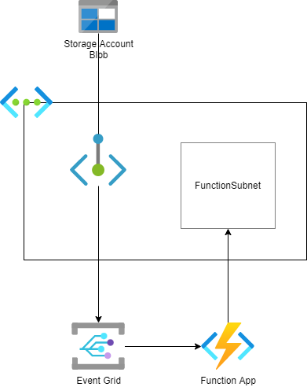

# Provision Blob triggered Function App with Event Grid



## Provision

### Function App and Blob Storage

```bash
az deployment group create -g <resource_group_name> -f 1-function-and-storage-account.bicep
```

### Deploy Function App

```bash
dotnet publish [options]
```


### Event Grid System Topic

```bash
az deployment group create -g <resource_group_name> -f 2-eventgrid-blob-function.bicep
```
